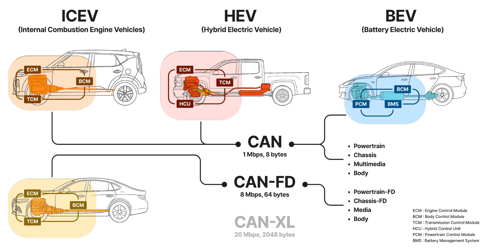
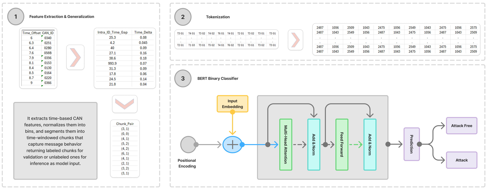

# 🧠 UIDS-II: Vehicle-Model Agnostic Intrusion Detection System

[](https://www.python.org/downloads/)
[](https://streamlit.io/)
[](https://onnxruntime.ai/)
[](https://pytorch.org/)
[](LICENSE)

A **universal intrusion detection system** for automotive CAN networks using **zero-shot temporal learning on BERT**. The system achieves cross-vehicle generalization across ICEV, HEV, BEV, and CAN-FD platforms without vehicle-specific retraining.

---

## 🎯 Abstract

This project implements a **vehicle-model agnostic intrusion detection system (UIDS)** that generalizes across heterogeneous automotive architectures without requiring vehicle-specific training. The system leverages:

- **MobileBERT-based temporal learning** for CAN traffic classification
- **Zero-shot transfer learning** across ICEV, HEV, BEV, and CAN-FD protocols
- **Cross-laboratory validation** (LISA, HCRL, DTU datasets)
- **Real-time ONNX inference** with Streamlit dashboard
- **F1-Score: 0.92-0.99** across all vehicle types
- **Recall: 1.000** from low validation conditions onward

### Detected Attack Types:
- **Denial-of-Service (DoS)**: High-priority bus flooding
- **Fuzzing**: Random malformed message injection
- **Replay**: Legitimate message retransmission

---

## ✨ Key Features

### 🔬 Technical Innovations
- **Universal Detection**: Single model works across Kia (ICEV), Tesla (BEV), Genesis (CAN-FD), Silverado (HEV)
- **Zero-Shot Learning**: No vehicle-specific fine-tuning required
- **Temporal Normalization**: Adaptive time-gap segmentation (τ = 83-160s)
- **MobileBERT Architecture**: 24 layers, 512 hidden dimensions, 8 attention heads
- **Cross-Lab Generalization**: Trained on LISA, validated on HCRL/DTU
- **ONNX Deployment**: Production-ready inference with CPU/GPU support

### ⚡ Performance Advantages
- **F1-Score**: 0.92-0.99 across all vehicle types
- **Recall**: 1.000 (perfect attack detection from low condition)
- **Cross-Domain Transfer**: 93-95% F1 on unseen lab datasets
- **Real-Time Processing**: Streamlit dashboard with configurable inference
- **Memory Efficient**: MobileBERT (4.3× smaller than BERT-BASE)

---

## 🏗️ System Architecture

### Vehicle Communication Network Comparison


*Fig. 1: Comparison of in-vehicle network architectures across ICEV, HEV, and BEV platforms showing protocol differences (CAN, CAN-FD, CAN-XL) and control unit distributions.*

The figure illustrates fundamental architectural differences:

| Vehicle Type | Primary Protocol | Key Control Units | Network Complexity |
|-------------|------------------|-------------------|-------------------|
| **ICEV** | CAN (1 Mbps) | ECU, BCM, TCM | Simple, mechanical-centric |
| **HEV** | CAN-FD (8 Mbps) | HCU, ECU, BMS | Dual powertrain coordination |
| **BEV** | CAN-XL (20 Mbps) | PCM, BMS, thermal mgmt | Software-centric, high-bandwidth |

### CAN Simulator Testbed

Our system includes a hardware testbed for safe attack reproduction:

**Components**:
- **Transmitter Node**: Reproduces legitimate CAN traffic from logs
- **Attacker Node**: Injects DoS, Fuzzing, Replay, Fabrication attacks
- **Receiver Node**: Real-time monitoring and IDS evaluation

**Hardware**: NVIDIA Jetson AGX Xavier with SN65HVD230 CAN transceiver

**Software**: C++17-based SocketCAN implementation with threaded attack vectors

---

## 📊 Dataset Overview

### Temporal Normalization Pipeline


*Fig. 4: End-to-end pipeline from CAN time-gap extraction through tokenization to BERT-based binary classification.*

### Data Collection Sources

| Dataset | Vehicle | Protocol | Source Lab | Scenarios |
|---------|---------|----------|------------|-----------|
| Kia Soul | ICEV | CAN | LISA, HCRL | DoS, Fuzz, Replay |
| Tesla Model 3 | BEV | CAN | LISA | DoS, Fuzz, Replay |
| Genesis G80 | ICEV | CAN-FD | LISA | DoS, Fuzz, Replay |
| Chevrolet Silverado | HEV | CAN | LISA | DoS, Fuzz, Replay |
| Hyundai Sonata | ICEV | CAN | HCRL | Validation |
| Subaru Forester | ICEV | CAN | DTU | Validation |

### Attack Injection Statistics

| Attack Type | Intensity | Total Messages | Injected | Injection Rate |
|-------------|-----------|----------------|----------|----------------|
| **DoS** | High | 760,000 | 160,000 | 21.05% |
| | Medium | 700,000 | 100,000 | 14.29% |
| | Low | 640,000 | 40,000 | 6.25% |
| | Lower-Low | 618,100 | 18,179 | 2.94% |
| **Fuzzing** | High | 760,000 | 160,000 | 21.05% |
| | Medium | 700,000 | 100,000 | 14.29% |
| | Low | 640,000 | 40,000 | 6.25% |
| **Replay** | High | 760,000 | 160,000 | 21.05% |
| | Medium | 700,000 | 100,000 | 14.29% |
| | Low | 640,000 | 40,000 | 6.25% |

### Temporal Segmentation Strategy

To harmonize heterogeneous CAN traffic, adaptive time-chunking is applied:

```
τ_v = {
  160s  for Subaru Forester (DTU)
  125s  for Kia Soul (HCRL)
  100s  for Kia Soul, Silverado (LISA)
  83s   for Tesla (LISA)
}
```

Segmentation ensures consistent message density (>265 frames per window) across all datasets.

---

## 🧠 Model Architecture

### MobileBERT Configuration

**Base Architecture**:
- **Model**: `google/mobilebert-uncased`
- **Layers (L)**: 24 transformer encoder blocks
- **Hidden Dimension (d_h)**: 512
- **Attention Heads (h)**: 8
- **Feed-Forward Dimension (d_ff)**: 3072
- **Parameters**: 25.3M (4.3× smaller than BERT-BASE)


### Training Hyperparameters

| Parameter | Value | Description |
|-----------|-------|-------------|
| **Epochs** | 3 | Full dataset passes |
| **Batch Size** | 8 | Per-device mini-batch |
| **Learning Rate** | 2×10⁻⁵ | AdamW optimizer |
| **Gradient Accumulation** | 2 steps | Simulates larger batch |
| **Max Sequence Length** | 512 tokens | Tokenizer limit |
| **Dropout** | 0.1 | Regularization |
| **Loss** | Binary Cross-Entropy | Attack vs. Normal |

---

## 📈 Experimental Results

### Cross-Vehicle Generalization

#### Train on Kia (CAN-ICEV) → Test on Other Vehicles

| Target Vehicle | Protocol | F1-Score | Recall | Precision |
|----------------|----------|----------|--------|-----------|
| Tesla | CAN-BEV | **0.880** | 1.000 | 0.786 |
| Genesis | CAN FD-ICEV | **0.974** | 1.000 | 0.949 |
| Silverado | CAN-HEV | **0.943** | 1.000 | 0.892 |

#### Train on Tesla (CAN-BEV) → Test on Other Vehicles

| Target Vehicle | Protocol | F1-Score | Recall | Precision |
|----------------|----------|----------|--------|-----------|
| Kia | CAN-ICEV | **0.963** | 1.000 | 0.929 |
| Genesis | CAN FD-ICEV | **0.985** | 1.000 | 0.971 |
| Silverado | CAN-HEV | **0.976** | 1.000 | 0.954 |

#### Train on Silverado (CAN-HEV) → Test on Other Vehicles

| Target Vehicle | Protocol | F1-Score | Recall | Precision |
|----------------|----------|----------|--------|-----------|
| Kia | CAN-ICEV | **0.950** | 1.000 | 0.905 |
| Tesla | CAN-BEV | **0.889** | 1.000 | 0.800 |
| Genesis | CAN FD-ICEV | **0.999** | 1.000 | 0.998 |

#### Train on Genesis (CAN FD-ICEV) → Test on Other Vehicles

| Target Vehicle | Protocol | F1-Score | Recall | Precision |
|----------------|----------|----------|--------|-----------|
| Kia | CAN-ICEV | **0.977** | 1.000 | 0.956 |
| Tesla | CAN-BEV | **0.922** | 1.000 | 0.855 |
| Silverado | CAN-HEV | **0.944** | 1.000 | 0.894 |

### Cross-Laboratory Validation

Training on **LISA** datasets, testing on **HCRL** and **DTU**:

| Training Vehicle | Target Lab | Target Vehicle | F1-Score | Recall |
|-----------------|------------|----------------|----------|--------|
| Kia (LISA) | HCRL | Hyundai Sonata | **0.952** | 1.000 |
| Kia (LISA) | DTU | Subaru Forester | **0.918** | 0.998 |
| Tesla (LISA) | HCRL | Hyundai Sonata | **0.945** | 1.000 |
| Tesla (LISA) | DTU | Subaru Forester | **0.931** | 0.999 |
| Silverado (LISA) | HCRL | Hyundai Sonata | **0.938** | 1.000 |
| Silverado (LISA) | DTU | Subaru Forester | **0.925** | 0.997 |
| Genesis (LISA) | HCRL | Hyundai Sonata | **0.948** | 1.000 |
| Genesis (LISA) | DTU | Subaru Forester | **0.934** | 0.999 |

### Key Findings

✅ **Perfect Attack Detection**: Recall = 1.000 from "low" validation conditions across all vehicles  
✅ **Strong Cross-Domain Transfer**: F1 = 0.93-0.95 on unseen lab datasets  
✅ **Protocol Agnostic**: Works equally well on CAN, CAN-FD, and mixed environments  
✅ **Powertrain Independent**: ICEV, HEV, BEV show comparable performance  
✅ **Zero-Shot Learning**: No vehicle-specific retraining required  

---

## 🚀 Installation

### Prerequisites
```bash
Python >= 3.10
PyTorch >= 2.0
ONNX Runtime >= 1.14
Streamlit >= 1.0
CUDA >= 11.0 (optional, for GPU acceleration)
```

### Setup

1. **Clone the repository**
```bash
git clone https://github.com/Arupreza/UIDS-II.git
cd UIDS-II
```

2. **Download Pre-trained Models and Test Data**

📥 **[Download from Google Drive](https://drive.google.com/drive/folders/1GOdTZ0cb4phX_8hPk1nQmYCGQFQj5PjR?usp=sharing)**

Extract and place:
- ONNX models → `UIDSApp/OnnxModels/`
- Test data → Your preferred location

3. **Create environment from YAML**
```bash
conda env create -f environment.yml
conda activate uidsapp
```

**Alternative (pip installation)**:
```bash
pip install -r requirements.txt
```

4. **Launch Streamlit Dashboard**
```bash
cd UIDSApp
streamlit run app.py
```

The dashboard opens at `http://localhost:8501`

---

## 💻 Usage

### Streamlit Dashboard Workflow

#### 1️⃣ Select Vehicle Model
Choose target vehicle:
- **Kia** (CAN-ICEV)
- **Genesis** (CAN FD-ICEV)
- **Tesla** (CAN-BEV)
- **Silverado** (CAN-HEV)

#### 2️⃣ Configure Parameters

| Parameter | Description |
|-----------|-------------|
| **CAN CSV Folder Path** | Directory containing `.csv` CAN logs |
| **Time Gap (seconds)** | Message segmentation window (83-160s) |
| **Runtime Device** | `cpu` or `cuda` (GPU acceleration) |
| **Mode** | `Validation` (with labels) or `Real-Life Inference` |

#### 3️⃣ Run Evaluation

Click **Start** to process:
1. Load ONNX model
2. Read all CSV files
3. Perform inference
4. Display metrics (accuracy, precision, recall, F1)
5. Show confusion matrix

### Python API for Custom Integration

```python
import onnxruntime as ort
import numpy as np

# Load ONNX model
session = ort.InferenceSession("OnnxModels/TrainKiaOnnx/model.onnx")

# Prepare input (normalized CAN features)
input_data = np.array([[...]], dtype=np.float32)  # Shape: [batch, seq_len, features]

# Run inference
outputs = session.run(None, {"input": input_data})
predictions = outputs[0]

# Classify
label = "Attack" if predictions[0] > 0.5 else "Normal"
print(f"Prediction: {label} (confidence: {predictions[0]:.4f})")
```

### Training Custom Models

```python
from transformers import MobileBertForSequenceClassification, Trainer

# Load pre-trained MobileBERT
model = MobileBertForSequenceClassification.from_pretrained(
    "google/mobilebert-uncased",
    num_labels=2
)

# Configure training
training_args = TrainingArguments(
    output_dir="./results",
    num_train_epochs=3,
    per_device_train_batch_size=8,
    learning_rate=2e-5,
    evaluation_strategy="epoch"
)

# Train
trainer = Trainer(
    model=model,
    args=training_args,
    train_dataset=train_dataset,
    eval_dataset=eval_dataset
)

trainer.train()
```

---

## 📁 Repository Structure

```
UIDS-II/
│
├── UIDSApp/                         # Streamlit Inference Dashboard
│   ├── OnnxModels/                  # Pre-trained ONNX models (download separately)
│   │   ├── TrainKiaOnnx/           # Kia ICEV models
│   │   ├── TrainGenOnnx/           # Genesis CAN-FD models
│   │   ├── TrainTeslaOnnx/         # Tesla BEV models
│   │   └── TrainSilOnnx/           # Silverado HEV models
│   ├── app.py                       # Streamlit dashboard
│   ├── EvaluateOnnx.py             # ONNX inference engine
│   ├── utils.py                     # Data preprocessing utilities
│   ├── environment.yml              # Conda environment
│   └── requirements.txt             # Pip dependencies
│
├── CANSimulator/                    # Hardware Testbed (C++17)
│   ├── CAN_transmitter.cpp         # Legitimate traffic replay
│   ├── Unified_Receiver.cpp        # Real-time monitoring
│   ├── CAN_attacker.cpp            # Attack vector injection
│   └── README.md                    # Testbed documentation
│
├── docs/
│   ├── images/
│   │   ├── vehicle_network_architectures.png  # Fig. 1
│   │   ├── bert_ids_pipeline.png              # Fig. 4
│   └── paper.pdf                    # Associated research paper
│
├── data/                            # Datasets (not included)
│   ├── LISA/
│   │   ├── kia_soul/
│   │   ├── tesla_model3/
│   │   ├── genesis_g80/
│   │   └── silverado/
│   ├── HCRL/
│   │   └── hyundai_sonata/
│   └── DTU/
│       └── subaru_forester/
│
├── environment.yml                  # Main conda environment
├── requirements.txt                 # Main pip dependencies
├── LICENSE
└── README.md                        # This file
```

---

## 📄 License

This project is licensed under the MIT License - see the [LICENSE](LICENSE) file for details.

---

## 🤝 Contributing

Contributions are welcome! Please feel free to submit a Pull Request.

1. Fork the repository
2. Create your feature branch (`git checkout -b feature/AmazingFeature`)
3. Commit your changes (`git commit -m 'Add some AmazingFeature'`)
4. Push to the branch (`git push origin feature/AmazingFeature`)
5. Open a Pull Request

---

## 📧 Contact

- **Md Rezanur Islam** - arupreza@sch.ac.kr
- **Donghyun Ryu** - rdh1999@sch.ac.kr
- **Kangbin Yim** - yim@sch.ac.kr

**Soonchunhyang University**  
Department of Software Convergence & Information Security Engineering  
Asan-si, South Korea

---

## 🙏 Acknowledgments

This research was supported by the MSIT (Ministry of Science and ICT), Korea, under the Convergence Security Core Talent Training Business Support Program (IITP-2024-2710008611) supervised by the IITP (Institute for Information & Communications Technology Planning & Evaluation) and Soonchunhyang University Research Fund.

**Special Thanks**:
- **LISA Lab** (Soonchunhyang University) - Dataset collection and validation
- **HCRL** - Cross-laboratory validation datasets
- **DTU** - Independent testbed validation
- **Hugging Face** - MobileBERT pre-trained models
- **Streamlit** - Interactive dashboard framework
- **ONNX Runtime** - Production inference optimization

---

**Keywords**: Intrusion Detection System, CAN Bus Security, Zero-Shot Learning, MobileBERT, Cross-Vehicle Generalization, ICEV, HEV, BEV, CAN-FD, Automotive Cybersecurity, Deep Learning, Transformer, ONNX